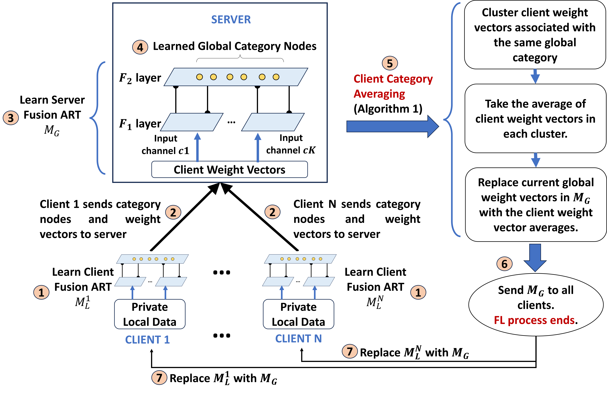

# FedART: A Neural Model Integrating Federated Learning with Adaptive Resonance Theory
This is the source code for FedART (paper under review in IEEE TNNLS).

Description: Federated Learning (FL) is a privacy-aware machine learning paradigm wherein multiple clients combine their locally learned models into a single global model without divulging their private data. However, current FL methods typically assume the use of a fixed network architecture across all the local and global models and they are unable to adapt the architecture of the individual models according to the local data, which is especially important for data that is not Independent and Identically Distributed (non-IID) across different clients. To address this limitation, we propose a novel FL method called Federated Adaptive Resonance Theory (FedART) which leverages the adaptive abilities of self-organizing Adaptive Resonance Theory (ART) neural network models. Based on ART, the client and global models in FedART dynamically adjust and expand their internal structure without being restricted to a predefined static architecture, providing architectural adaptability. In addition, FedART employs a universal learning mechanism that enables both federated clustering, by associating inputs to automatically growing categories, as well as federated classification by coassociating data and class labels. Our experiments conducted on various federated classification and clustering tasks show that FedART consistently outperforms state-of-the-art FL methods for data with non-IID distribution across clients.

## Code Organization:
  + 'fedart_supervised_learning' directory contains the data and source code related to supervised learning (classification).
     - 
